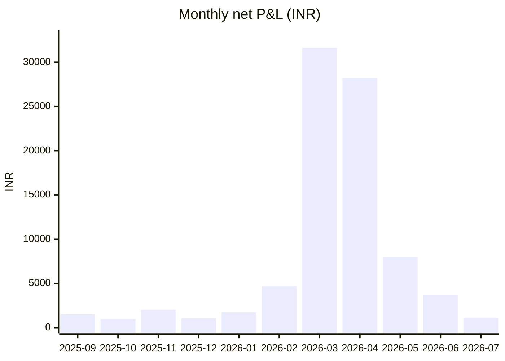
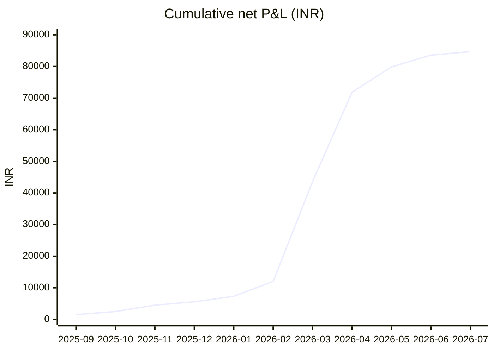

# Research Manuscript — NIFTY OTM16/17 Double-Sided Ratio Strategy

## Title
**Historical Backtest of a Double-Sided OTM16/17 NIFTY Ratio-Spread Structure Entered Four Trading Days Before Expiry**

## Abstract
This study evaluates a user-specified NIFTY options strategy consisting of buying one OTM16 call, selling two OTM17 calls, buying one OTM16 put and selling two OTM17 puts. Entries are made four trading days before expiry at 10:00 IST and positions are held to expiry. Strike selection uses the 10:00 NIFTY spot open on a 50-point strike grid. The empirical engine uses one-minute NIFTY spot and option data, executes the four legs at the 10:00 option-bar open with modeled premium slippage, and liquidates at the expiry-day 15:29 option-bar open. Brokerage, exchange charges, SEBI fee, stamp duty, STT and GST are modeled using the project's existing cost framework.

The bounded 2025–2026 source sample contained 92 candidate expiries. Forty-three complete trades were reconstructed; 49 candidates were excluded because at least one required source observation was unavailable. The 43 accepted trades produced ₹93,250.35 gross P&L and ₹84,698.69 net P&L after ₹8,551.66 of modeled costs. Mean net P&L was ₹1,969.74 per accepted trade and median net P&L was ₹733.62. All 43 accepted trades ended with positive net P&L. However, every accepted trade also experienced negative intratrade gross mark-to-market, and the worst observed trough was -₹24,394.50. The findings therefore indicate positive terminal historical P&L in the complete-trade sample together with substantial path risk and significant data-selection limitations.

## 1. Introduction
The strategy under study is a symmetric double-sided ratio structure positioned far out of the money on both calls and puts. The long legs sit 16 strike intervals from the entry ATM strike while the short legs sit 17 intervals away with double quantity. The structure is opened before expiry and left unchanged until expiry.

The central empirical question is whether this premium-collecting structure produced positive realized net P&L over the reconstructable historical sample once execution friction is included, and whether terminal profitability was accompanied by material interim adverse mark-to-market.

## 2. Research Questions

### Primary research question
What was the realized net P&L distribution of the specified NIFTY OTM16/17 double-sided ratio structure when entered four trading days before expiry at 10:00 IST and held to expiry after modeled transaction costs and slippage?

### Secondary research questions
1. How stable were results across 2025 and 2026?
2. How large were interim mark-to-market losses before expiry?
3. How much of gross P&L was consumed by modeled execution costs?
4. How much of the scheduled expiry sample could be reconstructed without missing source observations?
5. What structural payoff properties explain the relationship between terminal outcomes and path risk?

## 3. Aim
To evaluate the historical realized P&L and risk characteristics of the specified four-leg NIFTY structure using a reproducible one-minute historical backtest.

## 4. Objectives
1. Use the fourth prior **trading** day before each expiry.
2. Use the 10:00 NIFTY spot open to select the four strikes.
3. Execute all four option legs at the 10:00 option-bar open with fixed premium slippage.
4. Hold the exact quantities without rolling or re-centering.
5. Exit at the expiry-day 15:29 option-bar open.
6. Account for brokerage and exchange/statutory charges.
7. Preserve a trade-level ledger and data-quality record.
8. Evaluate terminal P&L and interim MTM risk separately.

## 5. Data

### 5.1 Data sources
The project uses:
- NIFTY 1-minute option data from the repository's validated Hugging Face option dataset.
- NIFTY 1-minute spot data from the repository's validated historical spot dataset.

### 5.2 Historical window
The bounded empirical run covers 2025 and the available portion of 2026 present in the selected sources at the time of the run.

### 5.3 Resolution
All spot and option observations used for execution/MTM are 1-minute bars.

### 5.4 Data completeness
There were 92 candidate expiry observations:
- 2025: 52 candidates, 15 complete trades.
- 2026: 40 candidates, 28 complete trades.

Overall acceptance rate was 43/92 = 46.74%.

The 49 excluded candidates comprised:
- 47 missing-entry-leg cases.
- 1 missing 10:00 spot case.
- 1 insufficient-prior-trading-day case.

No missing trade was fabricated or imputed.

## 6. Strategy Specification

Let A be the ATM strike derived from the 10:00 spot open using the 50-point strike grid.

### Call side
- Buy 1 × CE at A + 800.
- Sell 2 × CE at A + 850.

### Put side
- Buy 1 × PE at A - 800.
- Sell 2 × PE at A - 850.

### Entry
- Four trading days before expiry.
- 10:00 IST.
- Spot open determines strikes.
- Option-bar open determines execution prices.

### Exit
- 0 DTE.
- Expiry-day 15:29 IST option-bar open.
- Four legs closed independently.

### Execution friction
Baseline assumptions:
- ₹0.10 option-premium-point slippage per execution.
- ₹20 brokerage per executed order.
- Existing repository model for exchange charges, SEBI fee, stamp duty, STT and GST.

Each complete trade contains eight executed orders: four at entry and four at exit.

## 7. Scientific Methodology

The backtest is event-driven at the expiry level:
1. Identify candidate expiry.
2. Determine the fourth previous trading date from the spot trading calendar.
3. Read the 10:00 spot open.
4. Construct the OTM16/OTM17 strikes.
5. Read the 10:00 option-bar open for all four required legs.
6. Reject the trade if any required entry observation is unavailable.
7. Mark the open position at each available 1-minute option close during the holding window.
8. Read the expiry 15:29 option-bar open.
9. Close all four legs.
10. Apply modeled costs and record the realized net P&L.
11. Save the complete trade ledger and a separate data-quality/skip record.

The implementation uses predicate-pushed Parquet reads by expiry and strike, preventing unnecessary full-dataset materialization.

## 8. Statistical Analysis

### Primary descriptive metrics
- Number of trades.
- Win rate.
- Mean and median net P&L.
- Standard deviation.
- Aggregate gross and net P&L.
- Total and average modeled costs.
- Best and worst terminal trades.
- Profit factor.

### Path-risk metrics
- Minimum observed one-minute gross MTM within each trade.
- Maximum observed one-minute gross MTM.
- Peak-to-trough MTM range.
- Number and proportion of trades with negative intratrade MTM.

### Uncertainty calculations
A 95% Student-t interval for the mean net P&L was calculated as a descriptive interval under an independence assumption.

For the observed 43/43 positive terminal outcomes, an exact two-sided 95% Clopper–Pearson interval was used to describe uncertainty around the observed win rate.

These intervals are descriptive and do not establish future performance.

## 9. Results

### 9.1 Aggregate results

| Metric | Value |
|---|---:|
| Candidate expiries | 92 |
| Complete trades | 43 |
| Coverage | 46.74% |
| Terminal win rate | 100.00% |
| Gross P&L | ₹93,250.35 |
| Modeled costs | ₹8,551.66 |
| Net P&L | ₹84,698.69 |
| Mean net P&L/trade | ₹1,969.74 |
| Median net P&L/trade | ₹733.62 |
| Net P&L standard deviation | ₹3,468.47 |
| Worst terminal net P&L | ₹38.27 |
| Best terminal net P&L | ₹16,743.46 |
| Profit factor | Infinite/undefined |
| Mean modeled cost/trade | ₹198.88 |
| Cost as % of gross P&L | 9.17% |

### 9.2 Year-by-year results

| Year | Trades | Net P&L | Mean/trade | Median/trade | Win rate |
|---|---:|---:|---:|---:|---:|
| 2025 | 15 | ₹5,580.28 | ₹372.02 | ₹270.34 | 100% |
| 2026 | 28 | ₹79,118.41 | ₹2,825.66 | ₹1,261.77 | 100% |

The aggregate result is heavily influenced by the accepted 2026 sample.

### 9.3 Monthly net P&L chart

### 9.4 Cumulative net P&L chart

### 9.3 Monthly concentration
The largest monthly net P&L contributions were:
- March 2026: ₹31,629.34
- April 2026: ₹28,214.43
- May 2026: ₹7,985.61

This concentration indicates that a small number of high-volatility periods contributed a large share of aggregate P&L.

### 9.4 Path risk
Every accepted trade experienced at least one negative gross MTM observation.

Worst observed gross MTM trough:
**-₹24,394.50**, expiry 24-Mar-2026, entered 18-Mar-2026.

Largest peak-to-trough gross MTM swing:
**₹29,113.50**, in the same trade.

That trade ultimately closed at **+₹3,460.07 net** after modeled costs.

### 9.5 Mean uncertainty
The estimated standard error of mean net P&L is about ₹528.94. A descriptive 95% Student-t interval is approximately:
**₹902 to ₹3,037 per accepted trade.**

For 43 positive outcomes out of 43 accepted trades, the two-sided 95% exact binomial lower bound is approximately **91.78%**.

## 10. Structural Payoff Analysis

Ignoring option time value and transaction costs, the expiry payoff is the sum of two symmetric ratio spreads.

For the call side with A as entry ATM:
- S <= A+800: payoff = 0.
- A+800 < S <= A+850: payoff = S-(A+800).
- S > A+850: payoff = A+900-S.

The put side is symmetric:
- S >= A-800: payoff = 0.
- A-850 <= S < A-800: payoff = A-800-S.
- S < A-850: payoff = S-(A-900).

Therefore the structure has a 50-point favorable kink around each short strike, but beyond approximately A±900 the terminal intrinsic component becomes negative and continues worsening as the index moves farther into the tail.

The backtest's positive entry cash credit shifts terminal P&L upward, but does not remove the structural tail exposure.

## 11. Discussion

### 11.1 What the backtest shows
The accepted sample produced positive realized net P&L on every reconstructed trade. The average net result remained positive after modeled trading costs, and the estimated mean's descriptive confidence interval remained above zero under the independence-based t calculation.

### 11.2 What the backtest does not show
It does not establish a future 100% win rate. The acceptance rate was only 46.74% because 49 of 92 candidate expiries lacked complete source observations.

It also does not establish low capital requirements. Every accepted trade had negative intratrade gross MTM, and one trade reached approximately -₹24.4k before recovering to a positive expiry result.

### 11.3 Cost impact
Modeled costs removed 9.17% of gross P&L. This is economically material, especially because the structure uses eight executions per complete trade.

### 11.4 Regime dependence
The strong 2026 result relative to 2025 indicates that realized performance was not stable across the full sample. The phase intentionally does not mine regimes or optimize parameters, so the result should be considered descriptive rather than regime-adaptive.

## 12. Strengths
1. Exact implementation of the specified leg quantities.
2. Trading-day entry logic.
3. Same-minute look-ahead avoided by using the 10:00 spot open.
4. One-minute execution and MTM data.
5. Explicit slippage and brokerage.
6. Statutory/exchange cost model.
7. Historical lot-size changes included.
8. Missing observations explicitly tracked.
9. Intratrade MTM retained.
10. Previous strategy phases remain frozen.

## 13. Limitations
1. No historical bid/ask reconstruction.
2. Fixed slippage rather than liquidity-conditioned slippage.
3. Large data-selection gap from missing option legs.
4. No broker margin/capital model.
5. No position sizing optimization.
6. Weekly observations can share correlated market regimes.
7. Confidence intervals are not robust to serial dependence.
8. No independent out-of-sample validation in this phase.
9. Only one fixed parameterization was evaluated in this phase.
10. Expiry execution uses a bar-open proxy rather than actual fill records.

## 14. Conclusion
The frozen V4 implementation produced a positive realized net P&L in all 43 complete reconstructed trades in the available 2025–2026 sample, totaling **₹84,698.69 after modeled costs**.

The dominant risk observation is the discrepancy between terminal outcome and interim path: all accepted trades suffered negative intratrade gross MTM, and the worst observed trough was approximately **-₹24,394.50**.

Accordingly, the historical evidence supports the narrower statement that the specified structure showed positive terminal realized P&L in its complete-trade sample under the stated execution assumptions. It does not support the stronger statement that the strategy is low-risk, universally profitable, or suitable for deployment without further validation of liquidity, margin and tail behavior.

## 15. Future Research
1. Add explicit margin/capital simulation, including broker-specific requirements.
2. Reconstruct bid/ask and depth-sensitive slippage.
3. Add volatility/regime classification and conditional analysis.
4. Compare adjacent OTM distances in a pre-registered parameter grid.
5. Test alternative entry times and expiry distances.
6. Run walk-forward and out-of-sample validation.
7. Compare against the frozen V2 and V3 strategies using identical cost assumptions.
8. Evaluate capital utilization and return-on-margin rather than raw rupee P&L.
9. Add transaction-cost stress tests, including higher slippage and brokerage.
10. Evaluate gap/tail scenarios beyond the historical sample.

## Appendix A — Reproducibility
Branch: `phase-7-double-sided-otm16-17`

Core files:
- `research/strategy_spec_v4.md`
- `research/research_plan.md`
- `research/research_status_v4.md`
- `scripts/backtest_v4.py`
- `scripts/analyze_v4.py`
- `tests/test_v4_strategy.py`
- `.github/workflows/phase-7-double-sided-otm16-17.yml`

Output files:
- `results/strategy_v4_trades.csv`
- `results/strategy_v4_summary.csv`
- `results/strategy_v4_statistics.csv`
- `results/strategy_v4_yearly.csv`
- `results/strategy_v4_monthly.csv`
- `results/strategy_v4_data_quality.json`
- `results/strategy_v4_risk_analysis.csv`

## Appendix B — Cost and execution assumptions
- Premium slippage: ₹0.10 per option premium point per execution.
- Brokerage: ₹20 per executed order.
- 8 orders per complete trade.
- Existing project exchange/statutory charge model.
- No bid/ask reconstruction.
- Exit proxy: 15:29 expiry-day bar open.

## Appendix C — Phase stopping rule
This phase stops after validated backtest, descriptive/statistical analysis, result documentation, error logging and reproducibility outputs. Any new entry/exit rule or parameter search belongs in a new research phase.
